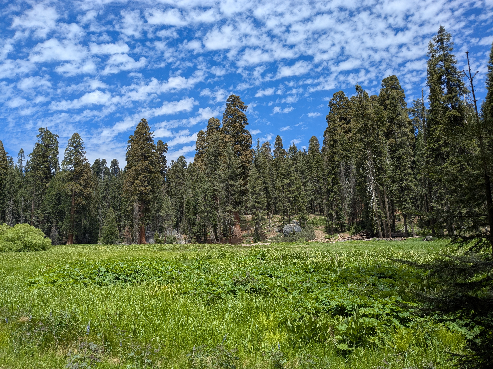

# Touch Grass API

Find the state or national park in California where you'd rather be!

### Get Started

The Touch Grass service is a great way to help you get away from your devices and head outside to California's great outdoors! Use visitor profiles to find parks that meet criteria related to things that interest you.

* Is the Touch Grass service right for you? Read more about [who uses the service](overview/overview.md).

* When you are ready, make sure you have [everything you need](overview/quickstart.md) to start using the API.

### Try It Yourself

Try one of the [tutorials](tutorials/tutorials.md) for some inspiration.

### API Reference

The Touch Grass API includes two resources: `parks` and `visitors`. See the references for each for more details.

* [Parks](api/parks.md)

* [Visitors](api/visitors.md)
